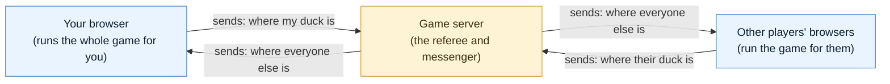
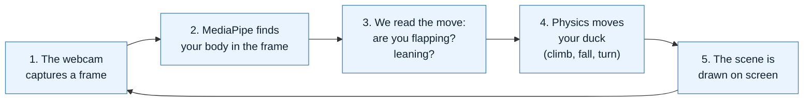
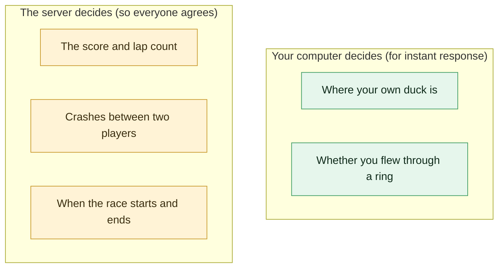
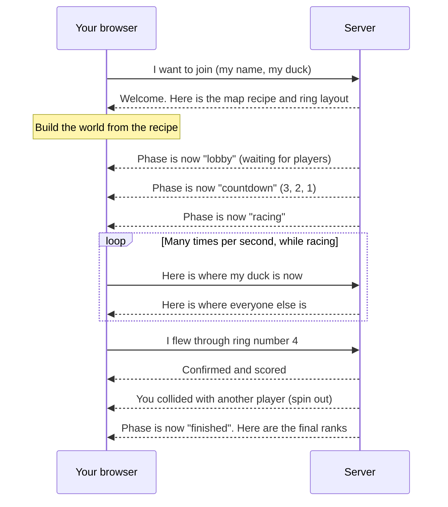
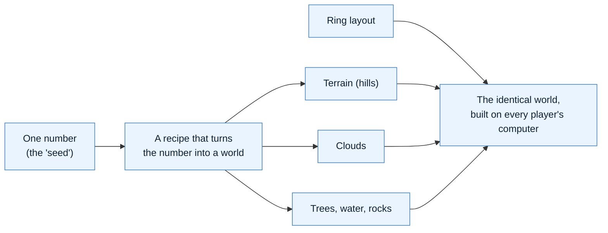
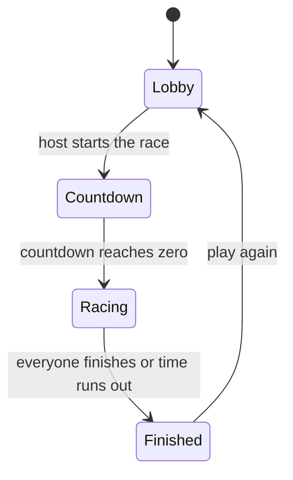
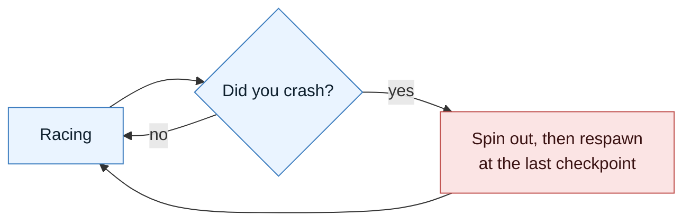
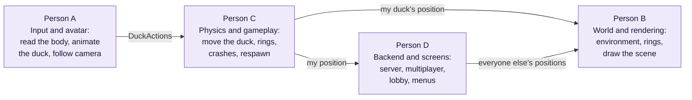

# DucksFly: Architecture

This document explains how DucksFly works, in plain language, with simple diagrams.
Each diagram answers one question and is followed by an explanation. For what the game
is and why, see [PRD.md](./PRD.md). For how it looks, see [DESIGN.md](./DESIGN.md). For
the exact tools and versions, see [TECH_STACK.md](./TECH_STACK.md).

The diagrams are written in Mermaid, a text format that renders as a picture
automatically on GitHub. If you are reading the raw text, the picture is described in
the paragraph right below each one.

A note on terms: this document explains each technical term the first time it appears,
and collects them all in the [glossary](#9-glossary) at the end.

---

## 1. The Big Picture

Question: where does the work happen?



Explanation. DucksFly is a browser game. Almost all the work happens inside each
player's own web browser: reading their body from the webcam, deciding how the duck
should move, and drawing the scene. The server in the middle does very little by
comparison. It acts like a referee and a messenger: it passes each player's position
along to everyone else, and it makes the final call on a few things that must be fair
(the score, crashes between players, and when the race starts and ends).

We chose this split on purpose. If the server had to calculate every duck's movement,
your own duck would feel laggy, because it would have to wait for a message to travel to
the server and back every time you flapped. By letting your own computer calculate your
own duck, your duck reacts the instant you move. This is explained more in section 3.

---

## 2. What Your Browser Does, Over and Over

Question: what happens between you flapping your arms and the duck moving?

This loop runs many times per second (ideally about 60), for your own duck.



Explanation, step by step.

1. The webcam captures a single still image (a "frame").
2. MediaPipe looks at that frame and reports where your body is. MediaPipe is a free
   Google library that finds the positions of a person's joints (shoulders, elbows,
   wrists, head) in a camera image. It does this directly in the browser, with no extra
   hardware.
3. We translate those joint positions into intent. If your wrists are moving up and down
   quickly, that is a flap. If your shoulders are tilted, that is a lean. We package this
   into a small, tidy object we call DuckActions (described in section 4).
4. The physics step takes that intent and updates the duck's position and speed: a flap
   adds upward thrust, gravity constantly pulls down, a lean turns the duck.
5. We draw the updated scene, then start over with the next webcam frame.

The key point: steps 1 through 5 all happen on your own computer. Your duck never waits
for the network, which is why it feels responsive.

---

## 3. Who Decides What

Question: if each player runs their own game, who settles disagreements?



Explanation. We divide authority (who has the final say) between the player's computer
and the server.

Your computer has the final say on where your own duck is. This keeps flying instant.
Your computer also decides whether you flew through a ring, because rings sit in fixed
positions that every player already agrees on, so there is nothing to dispute.

The server has the final say on the things that must be fair and identical for everyone:
the score, whether two players actually collided, and the timing of the race. We let the
server judge player-versus-player crashes specifically because two players should never
disagree about who crashed into whom. The server sees both players' positions and makes
one ruling.

The trade-off we accept: because each computer controls its own duck, a determined
cheater could fake their position. For a friendly hackathon race this is fine, and
avoiding it would require much more complex networking than 24 hours allows.

---

## 4. The Two Shared Agreements

For four people to build different parts at the same time, they must agree on the shape
of the data that passes between those parts. There are exactly two such agreements, and
they are written down on day one so nobody is blocked waiting for someone else.

DuckActions: the handoff from the input code to the physics code. It describes, for a
single moment, what the player is trying to do.

```ts
// Produced by the input code (Person A), consumed by the physics code (Person C).
DuckActions {
  flap: number         // how hard you are flapping, from 0 to 1
  flapImpulse: boolean // true on the exact frame a new flap begins
  lean: number         // -1 is full left, 0 is straight, +1 is full right
  dive: number         // how much you are diving, from 0 to 1
  quack: boolean       // is your mouth open
  egg67: boolean       // are you making the "six-seven" hand sign
  confidence: number   // how sure the camera tracking is (lets us fail gracefully)
}
```

RaceRoomState: what the server keeps track of and shares with everyone. ("Room" is the
networking term for one race that a group of players share.)

```ts
RaceRoomState {
  phase: "lobby" | "countdown" | "racing" | "finished"
  mapSeed: number      // one number that lets every client build the same world
  ringLayout: RingDef[]// where the rings are, sent once when you join
  countdownEndsAt: number
  players: Map<id, PlayerState>
}

PlayerState {
  id, name, duckVariant
  pos: [x, y, z]       // position, updated 15 to 20 times per second
  vel: [x, y, z]       // velocity (speed and direction)
  quat: [x, y, z, w]   // which way the duck is facing
  ringsPassed, lap, rank
  spunOut: boolean
}
```

Both of these live in a shared folder so the frontend and the server use the exact same
definitions.

---

## 5. Joining and Racing, Step by Step

Question: what messages travel between a player and the server during a race?

This is a sequence diagram. Time flows downward. Each arrow is a message from one side
to the other.



Explanation. When you join, the server welcomes you and sends the recipe for the world
(see section 6) and the ring positions. Your browser builds the world from that recipe.
The server then moves the whole group through phases: waiting in the lobby, a short
countdown, and then racing. During the race, your browser repeatedly tells the server
where your duck is, and the server repeatedly tells you where everyone else is. When you
fly through a ring, your browser reports it and the server confirms the score. If the
server detects that two players collided, it tells the affected player to spin out.
Finally, the server announces the race is finished and sends the final standings.

---

## 6. How the World Is Built From One Number

Question: how does every player get the exact same course without sending a huge file?



Explanation. Instead of sending a large 3D map across the network, the server sends one
number, called a seed. A seed is a starting value for a recipe that produces randomness
in a repeatable way: the same seed always produces the same result. Every player's
browser runs the same recipe with the same seed, so everyone builds an identical world,
with the hills, clouds, and trees in the same places. This keeps the network message
tiny and guarantees that all players see the same course. The exact ring positions are
sent alongside the seed so they are always in agreement.

---

## 7. The Race Phases

Question: what states does a race move through?

This is a state diagram. Each box is a phase the race can be in. Each arrow is a thing
that moves the race from one phase to the next.



Explanation. The race begins in the lobby, where players gather. The host starts it,
which begins a short countdown. When the countdown reaches zero, everyone is racing.
When all players finish or the time limit is reached, the race ends and shows the
results, after which players can return to the lobby to play again.

A crash during the race does not change the phase. The player spins out and respawns at
their last checkpoint, and the race continues:



---

## 8. Who Builds What

The work is divided into four parts so four people can build in parallel. The two shared
agreements from section 4 are the seams between them.



Explanation. Person A reads the player's body and produces the DuckActions object.
Person C turns those actions into actual movement. Person B draws the world, the player's
duck, and everyone else's ducks. Person D builds the server, the multiplayer
synchronization, and the menu screens. The arrows are the data that flows between them,
and they match the two shared agreements in section 4.

Important: the art is the biggest single-person risk, so we use a simple placeholder
duck (a basic shape) from the very start. That lets Person B and Person C build movement
and rendering without waiting for finished art. The real, rigged duck is already in the
project (see [DESIGN.md](./DESIGN.md)).

A fuller written breakdown of responsibilities is in the working notes at
[../prompts/duck-game-architecture.md](../prompts/duck-game-architecture.md). An earlier
variant of the split exists at [../FinalSplitArchitecture.md](../FinalSplitArchitecture.md);
the version in this document is the current one.

---

## 9. Glossary

- Browser game: a game that runs inside a web browser tab, with nothing to install.
- Server: a shared computer that all players connect to. In DucksFly it mostly relays
  messages and makes a few fair rulings, rather than running the game itself.
- Frame: a single still image from the camera, or a single drawn picture on screen.
  "60 frames per second" means this happens 60 times a second.
- MediaPipe: the Google library we use to find a person's body, face, and hands in a
  webcam image, directly in the browser. See [TECH_STACK.md](./TECH_STACK.md#glossary).
- DuckActions: our name for the small object describing what the player is trying to do
  in one frame (flap, lean, dive, quack). Defined in section 4.
- Physics: the code that turns intent into motion using rules like gravity and thrust.
- Authority (client-authoritative, server-authoritative): who has the final say over a
  piece of game state. "Client-authoritative" means the player's own computer decides;
  "server-authoritative" means the server decides. See section 3.
- Room: the networking term for one shared race that a group of players are in together.
- Seed: one number that a repeatable recipe turns into a whole world, so every player
  builds the identical course from the same number. See section 6.
- Interpolation: smoothly filling in the positions between the few updates per second
  that arrive over the network, so remote ducks glide instead of jumping.
- Checkpoint: a saved spot on the course; after a crash, you restart from the last one
  you reached.
- Sequence diagram / state diagram: two kinds of diagram. A sequence diagram shows
  messages between parties over time (section 5). A state diagram shows the phases
  something moves through (section 7).
