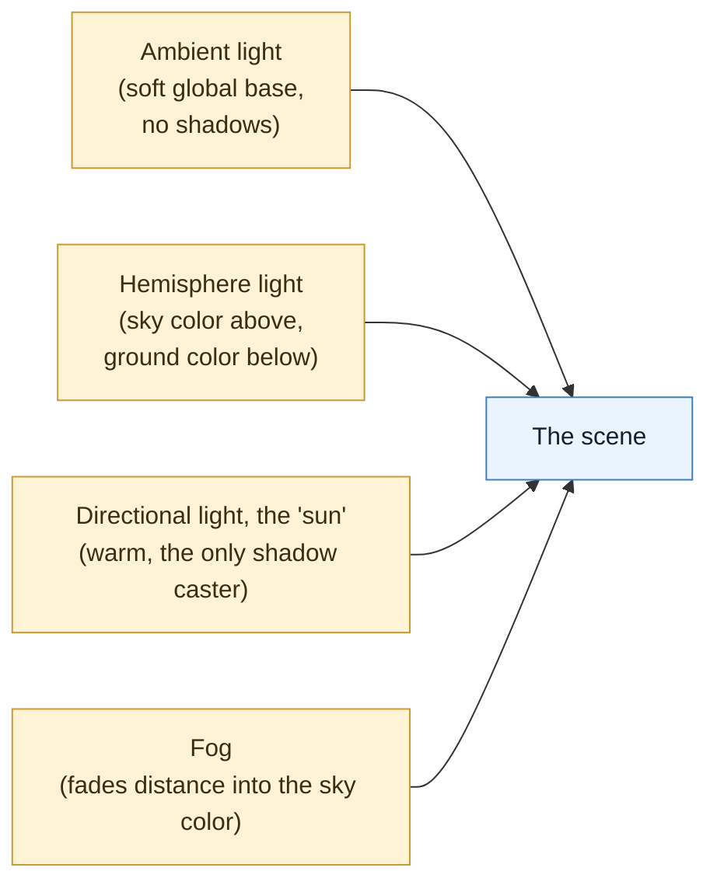
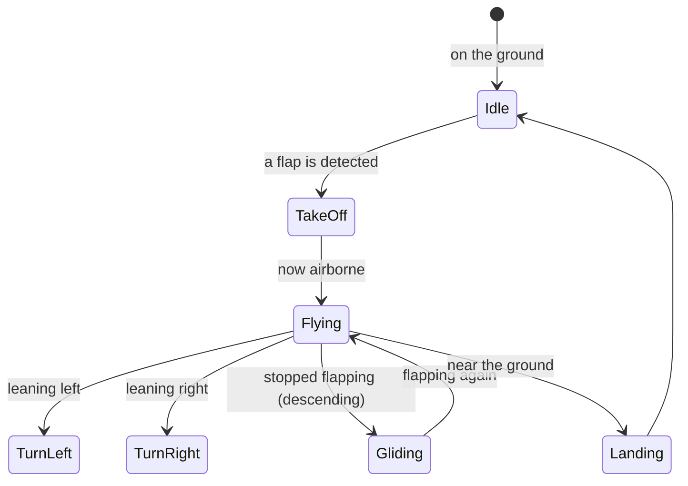

# DucksFly: Visual Design and Three.js Art Direction

This document describes how DucksFly should look, and how to build that look in code.
It is the bridge between the art direction (the feel we are going for) and the concrete
3D setup (lights, materials, colors). For what the game is, see [PRD.md](./PRD.md); for
how it works, see [ARCHITECTURE.md](./ARCHITECTURE.md).

Terms specific to 3D graphics and lighting are explained the first time they appear, and
collected in the [glossary](#10-glossary) at the end. The 3D library names (three.js,
React Three Fiber, drei) are explained in
[TECH_STACK.md](./TECH_STACK.md#glossary); briefly: three.js draws the 3D world, React
Three Fiber lets us describe that world in React, and drei is a set of ready-made helpers
for it.

---

## 1. The Art Direction in One Sentence

Bright, friendly, low-poly. "Low-poly" means 3D shapes built from a small number of flat
faces, so they look clean and simple rather than detailed and realistic, like folded
paper or a children's toy. The reference points are games like Crossy Road, Alto's
Odyssey, and Monument Valley, not photorealism. Above all, everything must read clearly
on a projector from across a room.

### The four guiding principles

1. Readability over detail. A duck seen from far away must still clearly be a duck.
   That means strong, recognizable shapes, high color contrast, and no fine surface
   detail that turns to noise at a distance.
2. Flat shading. We keep the hard, faceted look of low-poly geometry rather than
   smoothing it. The lighting, not the textures, creates the sense of form.
3. One warm key light plus soft fill light. A single main light acts as the sun, and two
   gentle fill lights keep the shadows from going pure black. This is cheap to render and
   looks consistent everywhere.
4. Depth through fog, not detail. Distant shapes fade into the sky color. This lets us
   keep the geometry simple and still feel like a wide-open sky.

---

## 2. Color Palette

A small, warm, bright palette. These are the design tokens (named, reusable color values
that the whole project refers to, so colors stay consistent).

| Role | Hex value | Where it is used |
|---|---|---|
| Sky, top | `#7EC8FF` | the top of the sky gradient |
| Sky, horizon | `#D7F0FF` | the horizon; the fog and background blend to this |
| Sun / main light | `#FFF4D6` | the warm color of the main light |
| Ambient fill | `#BFE3FF` | a soft, cool global fill light |
| Ground / grass | `#8FCB6B` | terrain |
| Water | `#4FA3D1` | rivers and sea, slightly see-through |
| Sand / land edge | `#E8D9A8` | beaches and paths |
| Forest | `#5E9E58` | tree canopies |
| Ring, active | `#FFC93C` (glowing) | boost rings, made to glow so they stand out against the sky |
| Ring, passed | `#9AA7B0` | a ring after you have flown through it (dimmed) |
| Duck, male | from `mallard-male.png` | green head, brown body |
| Duck, female | from `mallard-female.png` | brown |
| Danger / crash | `#FF5C5C` | the flash on a crash, and hazard accents |
| UI text | `#1E2A36` | dark slate, used for text on the light interface |

Keep these in one file (for example `src/theme/palette.ts`) so the sky, the fog, and the
lights all refer to the same horizon color. That shared color is what makes the depth
illusion work (see section 3).

---

## 3. Lighting Setup (the heart of the look)

Low-poly art succeeds or fails on its lighting. The whole world uses one set of three
lights, applied once at the top of the scene. Do not add separate lights to individual
objects.

First, the three terms, in plain language:
- Ambient light: a flat light that hits everything equally from all directions. It has no
  direction and casts no shadows. Its job is to keep shadowed areas from being pure
  black.
- Hemisphere light: a light with a sky color coming from above and a ground color coming
  from below, blending in between. It cheaply imitates the way real outdoor light bounces
  off the sky and the ground. This is the secret ingredient for nice low-poly shading.
- Directional light: a light that shines in one direction with parallel rays, like the
  sun. It is the only light that casts shadows in our setup.
- Fog: a setting that fades objects to a chosen color as they get farther away. We set
  the fog color to the horizon color so distant geometry melts into the sky.



| Light | Its job | Rough settings |
|---|---|---|
| Ambient light | Lifts shadows so nothing is pure black | color `#BFE3FF`, intensity about 0.4 |
| Hemisphere light | Free-looking outdoor fill; does most of the shading | sky `#9FD8FF`, ground `#8FCB6B`, intensity about 0.6 |
| Directional light (the sun) | The single warm main light and the only shadow caster | color `#FFF4D6`, intensity about 1.2, position `[-40, 60, 30]` |
| Fog | Fades distant geometry into the sky | color equals the horizon `#D7F0FF`, starts near 60, fully faded by 300 |

### How to build it in React Three Fiber

```tsx
import { Sky } from '@react-three/drei'

function WorldLighting() {
  return (
    <>
      {/* Soft global base so faces in shadow stay readable */}
      <ambientLight color="#BFE3FF" intensity={0.4} />

      {/* Sky-above, ground-below fill: does most of the low-poly shading for free */}
      <hemisphereLight color="#9FD8FF" groundColor="#8FCB6B" intensity={0.6} />

      {/* The sun: one warm main light, the only shadow caster */}
      <directionalLight
        color="#FFF4D6"
        intensity={1.2}
        position={[-40, 60, 30]}
        castShadow
        shadow-mapSize-width={2048}
        shadow-mapSize-height={2048}
        shadow-camera-near={1}
        shadow-camera-far={200}
        shadow-camera-left={-80}
        shadow-camera-right={80}
        shadow-camera-top={80}
        shadow-camera-bottom={-80}
      />
    </>
  )
}

// At the top-level Canvas:
// <Canvas shadows camera={{ fov: 60, near: 0.1, far: 320, position: [0, 4, 10] }}>
//   <color attach="background" args={['#D7F0FF']} />
//   <fog attach="fog" args={['#D7F0FF', 60, 300]} />
//   <Sky sunPosition={[-40, 60, 30]} turbidity={2} rayleigh={0.6} />
//   <WorldLighting />
//   ...
// </Canvas>
```

Why one directional light and not several: every extra shadow-casting light multiplies
the rendering cost and tends to look muddy on flat-shaded shapes. One angled sun gives
clean, readable shading. Make the visible sun (drei's `<Sky sunPosition>`) match the
directional light's position so the bright spot in the sky agrees with where the shadows
fall.

Shadow budget (keeping shadows cheap):
- Only one light casts shadows (the sun). Everything else has shadows turned off.
- A 2048-by-2048 shadow map is plenty of resolution. Drop to 1024 if the frame rate dips
  with eight ducks on screen. (A "shadow map" is an off-screen image the renderer uses to
  work out what is in shadow; bigger means sharper but slower.)
- Fit the shadow camera bounds tightly around the play area. A shadow region larger than
  needed wastes resolution and makes shadows both blurrier and slower.

---

## 4. Materials and Shading (the low-poly rules)

A "material" describes how a surface looks: its color and how it responds to light.

| Rule | Why |
|---|---|
| Use a standard material with flat shading turned on | Flat shading keeps the hard faceted faces that define the low-poly look, while still reacting correctly to the light setup. |
| No metalness, medium roughness (metalness 0, roughness about 0.8) | This gives a matte, paper-like surface with no shiny highlights. ("Metalness" and "roughness" are the two main sliders of a standard material: metalness controls how metal-like a surface is, roughness controls how sharp or soft its reflections are.) |
| Use simple colors or tiny texture images, not detailed photo textures | Keeps the look flat and cheap to render. The duck uses a 32-by-32-pixel color image. |
| Use nearest-neighbor filtering on those tiny images | This keeps the color blocks crisp instead of smearing them into a blur. ("Filtering" is how the renderer scales a small image up; nearest-neighbor picks the closest pixel, preserving hard edges.) |
| Flip the vertical orientation off for textures that came from FBX files | FBX files expect their images oriented this way; otherwise textures appear upside down. |
| Avoid bump, roughness, and similar detail maps entirely | They fight the flat look and cost memory. |

### The duck specifically

The rigged mallard at [frontend/public/models/duck/](../frontend/public/models/duck/) is
already set up to these rules in its loader,
[loadDuck.ts](../frontend/public/models/duck/loadDuck.ts):

- Its texture is a 32-by-32-pixel color image (`mallard-male.png` or
  `mallard-female.png`). Importantly, the texture is not stored inside the model file; the
  loader applies it, using nearest-neighbor filtering and the FBX orientation fix.
- It uses metalness 0 and roughness about 0.8, so it is matte and reads well under the
  light setup.
- Two appearances ship for the picker: male (green head) and female (brown).

Warning: load the duck through `loadDuck.ts`, not with a raw model loader. The raw model
renders white because its texture lives in a separate file. See the model's
[README](../frontend/public/models/duck/README.md).

---

## 5. The Duck: Animation Design

The duck carries 22 animation clips packed into a single timeline, which the loader
slices apart using [animations.json](../frontend/public/models/duck/animations.json). Map
them to flight states like this:



| Game state | Clip or clips | Loops? |
|---|---|---|
| On the ground, waiting | `idle_1`, `idle_2`, `sitting_idle_1`, `sitting_idle_2` | yes |
| Taking off | `take_off` | plays once |
| Flapping and climbing | `flight_straight` | yes |
| Banking | `flight_turn_left`, `flight_turn_right` | yes |
| Gliding and descending | `glide_straight`, `glide_turn_left`, `glide_turn_right` | yes |
| Slow, holding position | `hover_flight` | yes |
| Landing | `touch_down`, `water_touch_down` | plays once |
| On water | `swim_straight`, `swim_left`, `swim_right`, `water_idle_1` | yes |

- Crossfade between clips (blend over about a quarter second) so transitions look smooth.
  The loader's `play()` function does this. ("Crossfade" means blending the end of one
  animation into the start of the next instead of snapping between them.)
- There is no quack animation in the model. Drive the quack with a head or beak movement,
  a small visual effect, and a sound. Do not look for a quack clip; it does not exist.

---

## 6. Building the Environment

The world is built from the server's map recipe (the seed; see
[ARCHITECTURE.md](./ARCHITECTURE.md#6-how-the-world-is-built-from-one-number)). It is
layered to create a sense of depth.

```
+---------------------------------------------------------------+
|  Sky: a gradient from light blue at the top to pale at horizon |
|     The sun disc, positioned to match the main light          |
|        Low-poly cloud blocks, drifting slowly                  |
|     Glowing boost rings along the flight path                  |
|  Water (slightly see-through)   Forest   Hills (fading to fog) |
|  The ground fades into fog at the horizon                      |
+---------------------------------------------------------------+
```

| Element | Approach |
|---|---|
| Sky | drei's `<Sky>` gradient, with its sun position matched to the directional light |
| Clouds | Low-poly cloud shapes, drawn as instances (see note below), drifting gently |
| Terrain | A low-poly height map built from the seed, flat-shaded, with grass, sand, and forest color bands |
| Water | A single see-through plane with a subtle wobble; no reflections |
| Rings | Ring (torus) shapes with a glowing active color so they pop against the sky; dimmed once passed |
| Props | Trees and rocks placed by the seed and drawn as instances; keep the counts modest |
| Horizon | Anything past the fog distance is simply sky color, so no geometry is needed out there |

Performance budget (this must hold up with eight ducks at a smooth frame rate):
- Draw repeated objects (clouds, trees) as "instances." Instancing means drawing many
  copies of the same shape in a single, cheap operation instead of one expensive
  operation per copy.
- Only one light casts shadows.
- Keep the total number of separate draw operations modest (a few hundred at most).
- For other players' ducks, draw the same model but do not run their physics; just smooth
  their incoming positions (interpolation; see the
  [PRD glossary](./PRD.md#11-glossary)).
- Profile early. The real budget is MediaPipe plus the 3D rendering plus eight ducks all
  running on one machine at once (see [PRD.md](./PRD.md#10-risks-and-how-we-handle-them)).

---

## 7. The Interface and Screens

Keep the flat, 2D interface consistent with the world: rounded, light, and warm.

| Screen | What it contains |
|---|---|
| Home | Title, the "flap to fly" tagline, a Play button, and the duck appearance picker |
| Lobby | Ducks idling or walking, player nameplates, and a ready or start control |
| Countdown | A large 3, 2, 1 before the race begins |
| Race interface | Speed, rank or position, course progress, the off-screen-duck indicator, and quack feedback |
| Leaderboard | Final standings, times, and a play-again control |

- Interface text is dark slate `#1E2A36` on a light, slightly see-through panel, so it
  stays readable over a bright sky.
- Nameplates are labels that always face the camera, floating above each remote duck
  (drei provides helpers for this).
- The "six-seven" easter egg shows a punchy animated "6-7" on screen with a sound when
  the hand sign is detected.

---

## 8. Design Tokens: Quick Reference for Implementers

```ts
// src/theme/palette.ts  (the single source of truth for sky, fog, and lights)
export const SKY_TOP     = '#7EC8FF'
export const SKY_HORIZON = '#D7F0FF'  // also the fog color AND the background color
export const SUN_COLOR   = '#FFF4D6'
export const AMBIENT     = '#BFE3FF'
export const HEMI_SKY    = '#9FD8FF'
export const HEMI_GROUND = '#8FCB6B'
export const RING_ACTIVE = '#FFC93C'
export const DANGER      = '#FF5C5C'

export const SUN_POSITION: [number, number, number] = [-40, 60, 30]
export const FOG_NEAR = 60
export const FOG_FAR  = 300
```

The golden rule: the background color, the fog color, and the `<Sky>` horizon must all be
the same value. When they match, low-poly geometry melts into the horizon and the world
feels huge for almost no extra geometry.

---

## 9. Why These Choices

A short summary of the reasoning, so future changes do not accidentally break the look.

- Flat shading and simple colors are chosen because they read clearly at a distance and
  on a projector, which is the demo environment, and because they are cheap to render,
  which leaves performance headroom for body tracking and eight players.
- One sun plus two soft fill lights is chosen because multiple shadow-casting lights are
  both slower and muddier on faceted shapes; one angled light gives clean form.
- Fog matched to the horizon is chosen because it creates depth and a sense of scale for
  free, letting the geometry stay simple.
- Instancing repeated objects is chosen because the performance budget is tight: body
  tracking, rendering, and eight ducks share one machine.

---

## 10. Glossary

- Low-poly: 3D shapes made of relatively few flat faces, for a clean, simple,
  toy-or-papercraft look rather than realism.
- Flat shading: rendering that keeps each face a single, flat tone, preserving the hard
  faceted edges of low-poly geometry (as opposed to smooth shading that hides them).
- Material: the description of how a surface looks, including its color and how it
  reacts to light.
- Metalness and roughness: the two main controls of a standard material. Metalness sets
  how metal-like a surface is; roughness sets how sharp (low) or soft (high) its
  reflections are. We use metalness 0 and roughness about 0.8 for a matte look.
- Texture: an image wrapped onto a 3D surface to give it color or detail. The duck uses a
  tiny 32-by-32-pixel one.
- Filtering (nearest-neighbor): how the renderer scales an image up. Nearest-neighbor
  keeps hard pixel edges, which suits our tiny color textures.
- Ambient light: a flat, directionless light that lifts shadows so they are not pure
  black.
- Hemisphere light: a light with a sky color from above and a ground color from below,
  imitating bounced outdoor light.
- Directional light: a sun-like light with parallel rays shining in one direction; in our
  setup it is the only light that casts shadows.
- Fog: a setting that fades distant objects to a chosen color; we use the horizon color.
- Shadow map: an off-screen image the renderer uses to figure out what is in shadow.
  Larger is sharper but slower.
- Instancing: drawing many copies of the same shape in one cheap operation instead of one
  operation per copy. Used for clouds and trees.
- Crossfade: blending smoothly from one animation into the next rather than snapping
  between them.
- Rigged: a model that has an internal skeleton, which is what lets it be animated.
- Draw operation (draw call): one instruction to the graphics hardware to draw something.
  Fewer is faster, which is why we instance repeated objects.
