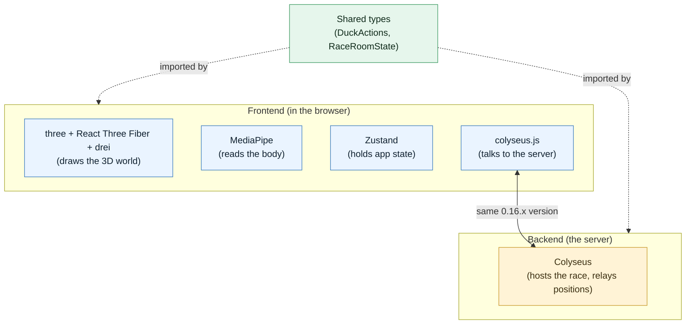

# DucksFly: Pinned Tech Stack

This is the authoritative list of the tools DucksFly is built with, and the exact
versions we lock to. "Pinned" means we fix the versions so every team member builds
against the same thing and nothing shifts under us mid-hackathon.

If you are new to these tools, read the [glossary](#glossary) first. It explains what
each one is and how DucksFly uses it, in plain language. The version tables come after.

For the reasoning behind these choices, see [ARCHITECTURE.md](./ARCHITECTURE.md). For
product scope, see [PRD.md](./PRD.md).

The tables are split into two groups:
- Installed and locked: exact versions already recorded in the committed lockfile.
- To install: chosen but not yet added. We lock the exact version when we install it,
  then move it up into the locked table.

A note on what a lockfile is: when you install packages, the package manager writes a
file (`package-lock.json`) recording the exact version of every package. That file is the
real source of truth for versions; the tables below mirror it for humans to read.

---

## Toolchain (the host environment)

| Tool | Version | What it is here for |
|---|---|---|
| Node.js | 26.0.0 | The program that runs JavaScript outside the browser. We use it to build the frontend and to run the game server. |
| npm | 11.12.1 | The package manager that installs and locks our dependencies. |
| Platform | macOS (darwin) | The development machines. |

Note: the dev machine is on Node 26, which is current and bleeding-edge. Pin the whole
team to Node 26 to avoid version drift. If a teammate is on an older long-term-support
version (22 or 24) and hits an engine error, the fix is to move them up to 26.

---

## Frontend: installed and locked

These are the exact versions from the committed `frontend/package-lock.json`. The
`node_modules` folder is not installed yet; running `npm install` in `frontend/` will
materialize exactly these versions.

| Package | Version | Role (see glossary for detail) |
|---|---|---|
| react | 19.2.6 | The UI framework. |
| react-dom | 19.2.6 | Connects React to the browser page. |
| typescript | 6.0.3 | JavaScript with type checking, to catch mistakes early. |
| vite | 8.0.14 | The development server and build tool. |
| @vitejs/plugin-react | 6.0.2 | Lets Vite work smoothly with React. |
| eslint | 10.4.1 | Checks code for common mistakes and style issues. |
| @eslint/js | 10.0.1 | Core rule set for ESLint. |
| typescript-eslint | 8.60.0 | ESLint rules specific to TypeScript. |
| eslint-plugin-react-hooks | 7.1.1 | ESLint rules for React. |
| eslint-plugin-react-refresh | 0.5.2 | ESLint support for live-reloading React. |
| globals | 17.6.0 | Tells ESLint about built-in browser names. |
| @types/react | 19.2.15 | Type definitions for React. |
| @types/react-dom | 19.2.3 | Type definitions for react-dom. |
| @types/node | 24.12.4 | Type definitions for Node.js. |

Note: this is a very recent stack (React 19.2, Vite 8, TypeScript 6, ESLint 10). When
adding the packages in the next section, check that they are compatible with these exact
versions. In particular, the React-19-compatible lines are React Three Fiber version 9
or newer and drei version 10 or newer.

---

## Frontend: to install

Run these from the `frontend/` folder. After installing, read back the resolved version
and move the package into the locked table above with its exact number.

### 3D rendering

```bash
npm i three @react-three/fiber @react-three/drei
npm i -D @types/three
```

| Package | Target version | Role | Compatibility note |
|---|---|---|---|
| three | latest stable (0.18x line) | The 3D engine that draws the world. Also used by the duck loader already in the project. | Required for the existing `loadDuck.ts` to compile. |
| @react-three/fiber | ^9 | Lets us write the 3D scene using React. | Version 9 supports React 19. Do not use version 8. |
| @react-three/drei | ^10 | Ready-made 3D helpers (sky, cameras, loaders, labels). | Version 10 pairs with React Three Fiber version 9. |
| @types/three | match three | Type definitions for three. | Keep aligned with the three version. |

The duck loader at
[frontend/src/world/loadDuck.ts](../frontend/src/world/loadDuck.ts)
already imports three; installing three makes it compile.

### Body tracking

```bash
npm i @mediapipe/tasks-vision
```

| Package | Target version | Role |
|---|---|---|
| @mediapipe/tasks-vision | latest 0.10.x | Reads the player's body (required), and optionally face and hands. |

Note: body pose is the only required signal. Face (for the quack) and hands (for the
easter egg) are optional. They run less often or are dropped entirely if performance
suffers, because running three trackers on one webcam stream is the top performance risk
(see [PRD.md](./PRD.md#10-risks-and-how-we-handle-them)).

### State management

```bash
npm i zustand
```

| Package | Target version | Role |
|---|---|---|
| zustand | ^5 | Holds shared app state (current screen, race phase, settings) in one place. |

### Multiplayer client

```bash
npm i colyseus.js
```

| Package | Target version | Role |
|---|---|---|
| colyseus.js | ^0.16 (match the server) | The client half of the multiplayer system; talks to the server. |

---

## Backend: to install

Run these from the `backend/` folder. The backend is the game server: it hosts the race
room, relays positions, and makes the fair rulings described in
[ARCHITECTURE.md](./ARCHITECTURE.md#3-who-decides-what).

```bash
npm i colyseus @colyseus/core @colyseus/schema
npm i -D typescript tsx @types/node
```

| Package | Target version | Role |
|---|---|---|
| colyseus / @colyseus/core | ^0.16 | The multiplayer server framework (rooms, lobby, broadcasting). |
| @colyseus/schema | match colyseus | Efficiently syncs the shared room state to all clients. |
| typescript | align with frontend (6.x) | Same language on both sides. |
| tsx | latest | Runs the TypeScript server during development without a separate build step. |
| @types/node | ^24 | Type definitions for Node.js. |

Important: keep the client (`colyseus.js`) and the server (`colyseus`) on the same minor
version (0.16.x). They must agree on the network format to talk to each other.

---

## Shared code

```
types/   holds the two shared agreements: DuckActions and RaceRoomState
```

| What | Role |
|---|---|
| A `types/` folder of plain TypeScript | The two shared agreements from [ARCHITECTURE.md](./ARCHITECTURE.md#4-the-two-shared-agreements). Built on day one and imported by both the frontend and the server, so both sides use one definition. |

---

## The Stack at a Glance



---

## Pinning Policy

1. Commit the lockfiles (`frontend/package-lock.json`, and one in `backend/`). The
   lockfile is the real pin; the tables here are the human-readable mirror.
2. The locked tables use exact versions, with no `^` or `~` symbols. (Those symbols in
   `package.json` allow ranges; what actually ships is whatever the lockfile records.)
3. When you install one of the "to install" packages, read back the resolved version and
   move it into the locked table with its exact number.
4. Match versions across boundaries: three with @types/three; colyseus with colyseus.js
   on the same minor version; React Three Fiber 9 with drei 10 with React 19.
5. Do not upgrade mid-hackathon. Lock at the start, build, and ship. Upgrades come after
   the demo.

---

## How to Run (current state)

Frontend (also in [frontend/HowToRun.md](../frontend/HowToRun.md)):

```bash
cd frontend
npm install
npm run dev          # starts the Vite dev server with live reload
```

Other scripts: `npm run build` (type-check then build for production), `npm run lint`
(check the code), `npm run preview` (preview the production build).

Backend: the server is not scaffolded yet. See
[backend/HowToRun.md](../backend/HowToRun.md).

---

## Glossary

What each tool is, and how DucksFly uses it.

- Node.js. What it is: a program that runs JavaScript on a computer instead of inside a
  web browser. How we use it: to build the frontend and to run the game server.

- npm. What it is: the standard package manager for JavaScript; it downloads libraries
  and records their exact versions. How we use it: to install and lock every dependency
  in this document.

- TypeScript. What it is: the JavaScript language plus a type system, which checks that,
  for example, you do not pass text where a number is expected. How we use it: it is the
  language for the whole project, frontend and server, so mistakes are caught while
  typing rather than at runtime.

- React. What it is: a popular library for building user interfaces out of reusable
  components. How we use it: it powers the menu screens (home, lobby, leaderboard) and is
  the foundation that React Three Fiber builds on.

- Vite. What it is: a fast development server and build tool for web projects. How we use
  it: it serves the game while we develop (with instant reloading when we save a file)
  and bundles the final version for the demo.

- three.js (the package is "three"). What it is: the most widely used 3D graphics library
  for the web; it draws 3D scenes using the browser's graphics hardware. How we use it:
  it draws everything you see in the game world, and it loads the duck model.

- React Three Fiber (the package is "@react-three/fiber"). What it is: a way to write
  three.js scenes using React components instead of manual setup code. How we use it: so
  the 3D world is described in the same React style as the menus, which keeps the whole
  frontend consistent.

- drei (the package is "@react-three/drei"). What it is: a collection of ready-made
  helpers for React Three Fiber, such as a sky, cameras, model loaders, and on-screen
  labels. How we use it: to avoid rebuilding common pieces from scratch, for example the
  gradient sky and the nameplates above ducks.

- MediaPipe (the package is "@mediapipe/tasks-vision"). What it is: a Google library that
  analyzes camera images to find a person's body pose, face, and hands, running directly
  in the browser with no special hardware. How we use it: it is the heart of the
  controls. We read body pose to detect flapping and leaning (required), and optionally
  the face (mouth open to quack) and hands (the "six-seven" sign). We never store or
  upload the video.

- Zustand. What it is: a small, simple library for storing state that many parts of the
  app need to read and change (the German word "Zustand" means "state"). How we use it:
  to hold things like the current screen, the race phase, and the player's settings in
  one place, so any component can read them without passing data through many layers.

- Colyseus (server package "colyseus"; client package "colyseus.js"). What it is: a
  framework for real-time multiplayer games that provides rooms, a lobby, and automatic
  state synchronization out of the box. How we use it: the server hosts a race room and
  shares each player's position with everyone else automatically, which saves us from
  hand-building all of that networking in 24 hours.

- @colyseus/schema. What it is: the part of Colyseus that efficiently sends only what
  changed in the shared state to each client. How we use it: to keep the position updates
  small and fast for up to eight players.

- WebGL. What it is: the browser technology that lets web pages use the computer's
  graphics hardware to draw 3D. How we use it: three.js uses it under the hood; we do not
  write WebGL directly.

- FBX, GLB, GLTF. What they are: file formats for 3D models. FBX is a common format from
  3D tools (the duck ships as FBX). GLTF and its compact binary form GLB are the formats
  designed for the web. How we use them: the duck is currently an FBX, loaded by our own
  loader; if we later want the standard web path or a smaller file, we can convert it to
  GLB.

- Lockfile. What it is: the file (`package-lock.json`) that records the exact installed
  version of every dependency. How we use it: it is the real version pin; we commit it so
  every machine installs identical versions.
